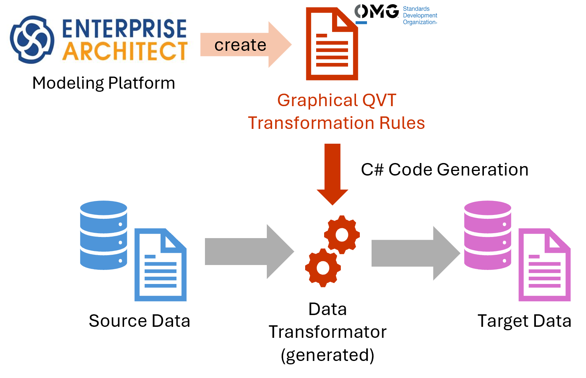

# QVT Code Generator 

Design data transformations visually in **Enterprise Architect** using the [OMG QVT](http://www.omg.org/spec/QVT/) standard, and let this tool generate ready-to-run **C# code** that carries out the transformation for you — no hand-written mapping code required.

*Initial author: Erwan Bousse*

*Solution architect: Dr. Oliver Alt*

## Further information & Demo Video
* [Blog post "Was ist QVT?"](https://mdd4all.de/2026/07/07/was-ist-qvt/) at MDD4All.de by Oliver Alt (in german)

## Download

The Enterprise Architect plugin (installer `.msi`) is built automatically on every push to `master`.

* **[Latest builds & installer download](https://github.com/oalt/QvtCodeGenerator-dev/actions/workflows/QVT-CodeGenerator-plugin-build.yml)**

Open the most recent successful run and download the `QVT-CodeGenerator-Plugin-Setup_*` artifact from its *Artifacts* section (you need to be signed in to GitHub to download workflow artifacts).

## Requirements

- [NMF](https://github.com/NMFCode/NMF)
- Sprax Systems Enterprise Architect

A guided walkthrough is available in the [slides](doc/slides-public.pdf).

## Technical Architecture

The generator is a small pipeline of C# components:

- **EA transformation importer** reads the graphical QVT relations from an Enterprise Architect project into an in-memory QVT Relations model.
- **Transformation Code generator** turns that in-memory model into the generated C# "Data Transformator" that performs the actual data transformation.
- **QVT textual concrete syntax generator** can additionally render the same relations as textual QVT syntax.
- **EA code generator** packages the generated transformer back into the Enterprise Architect plugin.

The codebase is split into several independently versioned components (see [`.gitmodules`](.gitmodules)), most notably:

| Component | Role |
|---|---|
| `LL.MDE.Components.Qvt.CodeGenerator` | Core QVT-relations-to-C# code generator |
| `LL.MDE.Components.Qvt.Metamodel` / `...Metamodel.Generator` | QVT (EMOF-based) metamodel and its [NMF](https://github.com/NMFCode/NMF)-based generator |
| `LL.MDE.Components.Qvt.EnArImport` / `...EnArIntegration` / `...EnArInterface` | Enterprise Architect model import and integration |
| `LL.MDE.Components.Qvt.TextConcreteSyntaxGen` | Textual QVT concrete syntax generator |
| `MDD4All.QvtCodeGenerator.Apps.EaPlugin` | The Enterprise Architect plugin (and its installer) built from the components above |

Each component lives in its own repository and is included here as a git submodule under `src/<ComponentName>`.

## Resources

* [LieberLieber Software GmbH](https://lieberlieber.com)
* [SpecIFicator - Dr. Oliver Alt](https://specificator.com)

